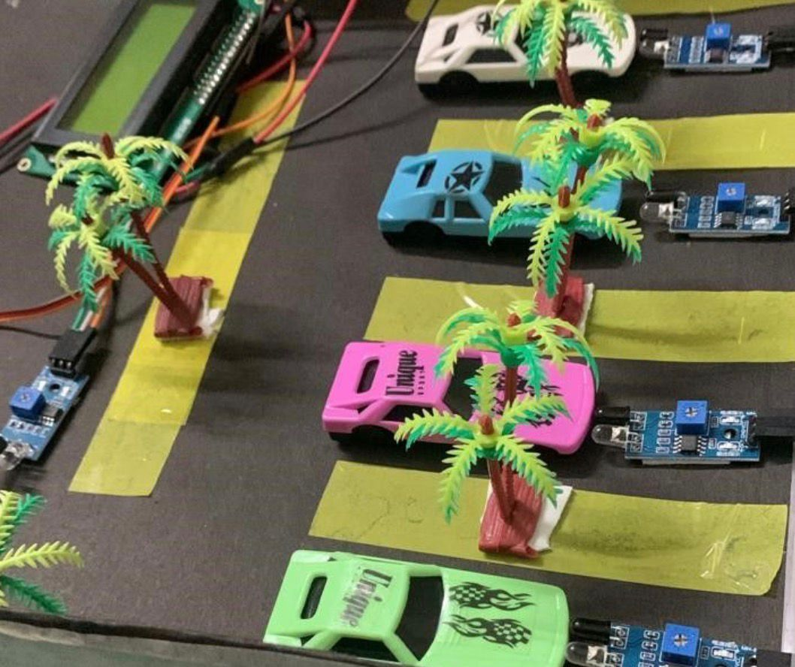
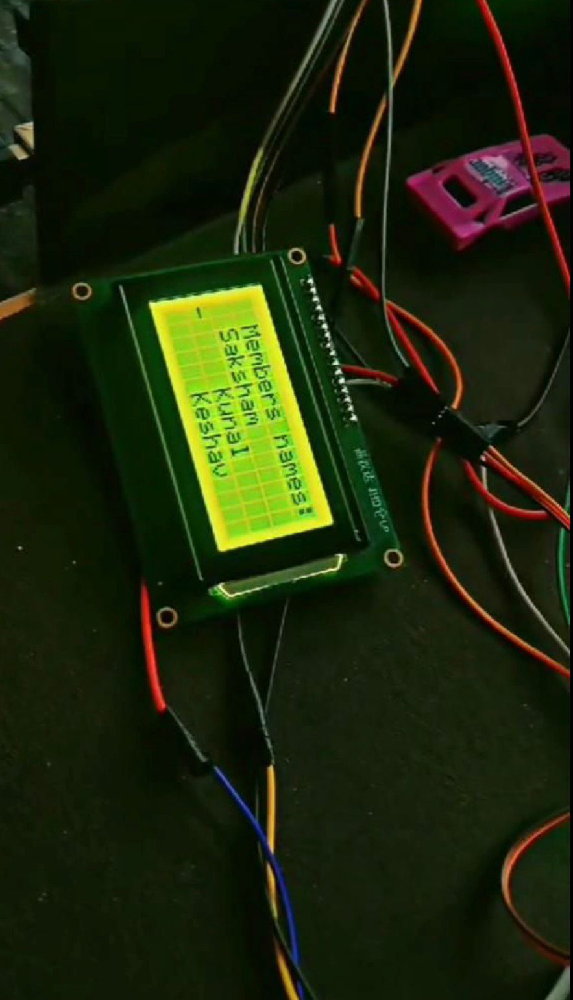
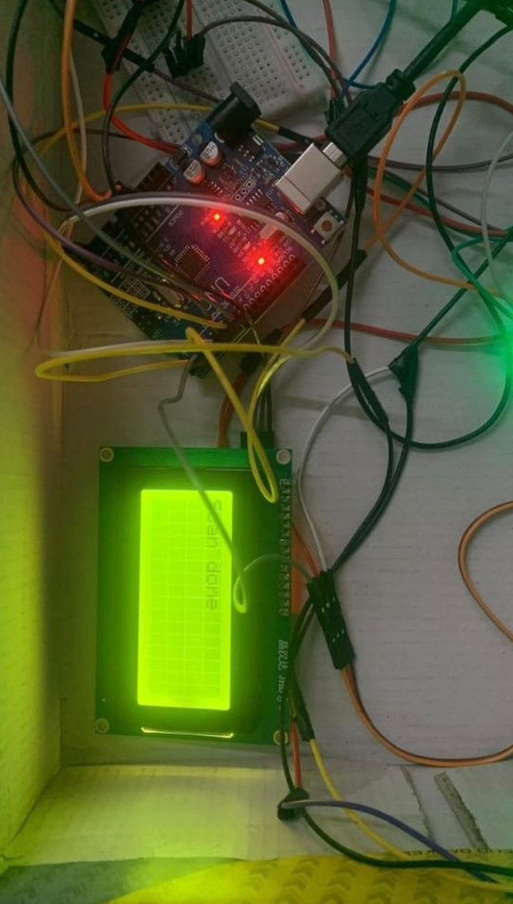

\# 🚗 Smart Parking Management System (Arduino)

\## Overview

This was one of my first Arduino-based projects where I tried to build a simple parking system using IR sensors and a servo motor.

The system detects whether parking slots are occupied and shows the status on an LCD display. A servo motor is used to simulate a gate at the entrance.

\---

\## Components Used

\* Arduino Uno

\* IR Sensors

\* Servo Motor

\* 16x2 LCD (I2C)

\* Jumper wires

\---

\## Working

\* When a car arrives at the entrance, the IR sensor detects it

&#x20; → Gate opens using servo

\* Each parking slot has an IR sensor

&#x20; → If occupied → shows "Full"

&#x20; → Else → shows "Free"

\* LCD updates status continuously

\---

\## Issues Faced

\* LCD display was very faint initially

&#x20; → Fixed by connecting to 5V instead of 3.3V

\* IR sensor gave false readings sometimes

&#x20; → Improved by adjusting placement

\---

\## Future Improvements

\* Add IoT integration

\* Use better sensors (ultrasonic)

\* Add mobile app

\---

\## 📁 Project Structure

smart\_parking.ino

README.md

images/

\---

\## Note

This was one of my early projects to understand basic sensor interfacing and automation.

## 📸 Project Images

### Parking Model Setup

### LCD Output Display

### Wiring and Circuit Setup

